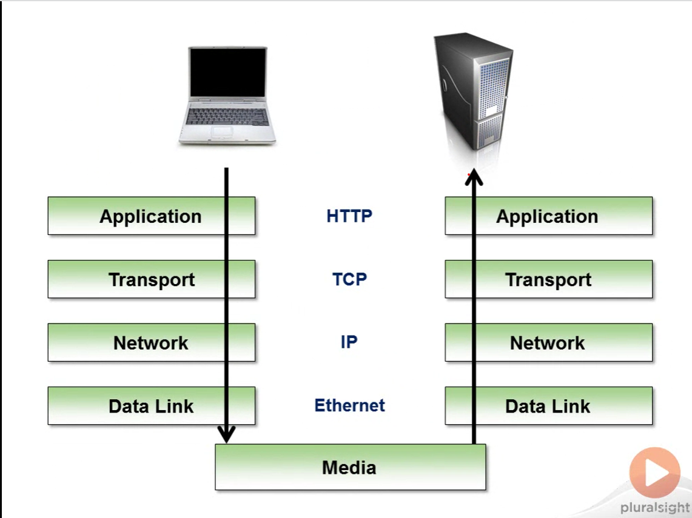
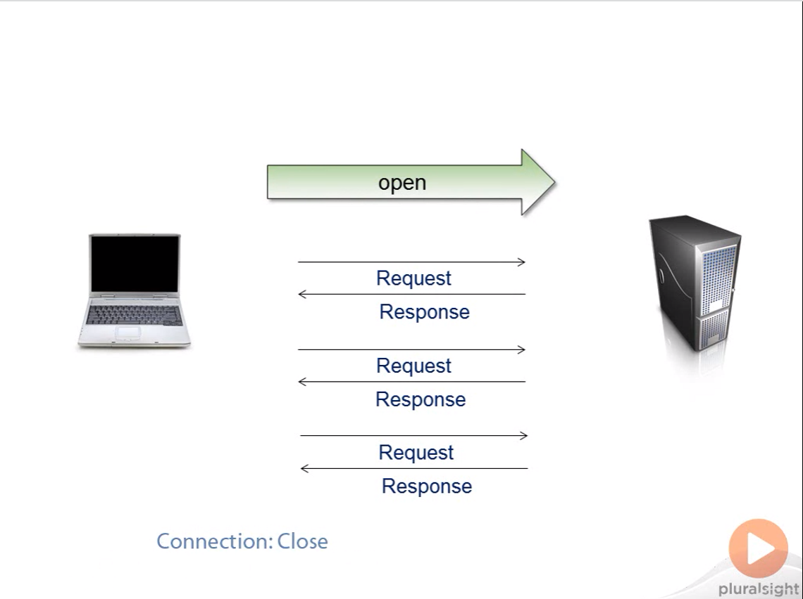

# HTTP

##Basic
1. Resources
2. Messages
3. Connections
4. Security
5. Hardware

## 1. Resources

URL - Uniform Resource Locator
http://www.food.com/

http://www.food.com/recipe/grilled-cauliflower
Lets breakdown this url

### 2. URL Scheme
http://  << URL Scheme
URL Scheme describes how to access a particular resource. In this case Hyper Text Transfer Protocol(HTTP).
Some more example of URL Scheme is 

ftp://server.com/download/xyz.pdf
ftp:// << File Transfer Protocol

mailto://xyz@example.com
mailto:// << for email address.

So everything after :// is specific to a particular Scheme.

### 3. Host
http://www.food.com/recipe/grilled-cauliflower

food.com << Host. It tells my browser which computer in the internet is hosting the resource.
My computer will use the Domain Name System(DNS) to know food.com == 204.78.50.82(Ip address)
so
http://www.food.com/recipe/grilled-cauliflower == http://www.204.78.50.82/recipe/grilled-cauliflower

### 4. URL Path
http://www.food.com/recipe/grilled-cauliflower

/recipe/grilled-cauliflower << url path.

### 5. Port Number :
http://food.com:80/recipe/grilled-cauliflower

:80 << port number. It's the default port num for HTTP request

### 6. Query
http://bing.com/search?q=asdjksahd

search << URL Path
?q=asdjksahd  << Query

### 7. Fragment
http://wikipedia.org/wiki/jabuticaba#Description

#Dscrption << Fragment

### 8. Character Encoding

The printable ASCII Character 

Lower case Alphabet, Upper case Alphabet, digits and some few special character $_.+'(),

Unfortunately you still can transmit UNSAFE character in url but they need to be "%" encoded or url encoded 

Space	%20  "  	%22   < 	%3C  >  	%3E etc.

For more info [Visit here](https://developers.google.com/maps/url-encoding)

Almost every web framework have API for URL encoding.

### 9. Content Type

When A Host/Server get an request it returns a resource and also a content type its also known as media type of the resource.
The content type server will specify rely on the Multipurpose Internet Mail Extension (MIME).

For more info[Visit here](https://developer.mozilla.org/en-US/docs/Web/HTTP/Basics_of_HTTP/MIME_types#audio_and_video_types)

ex : application/pdf is for .pdf file

### 10. Content Negotiation

Different country/language can request server for same resources. Now question is which version server should return ?
Thats where the content negotiation mechanism comes in. 

A client can also send request with media type that it will accept.

### 11. Message Type

HTTP > HTTP1.1 define language that can understand every client and server on the internet.
It defines messages can exchange on the web.

There are two types of messages.
1. HTTP Request . Client sends to the server
2. HTTP Response. Server sends back to the client

### 12. HTTP Request Methods

GET : Retrieve a resource
POST : Update a resource
PUT : Store a resource
DELETE : Remove a resource
HEAD : Retrieve the headers for a resource

Many more but HTML specification only use GET and POST

### 13. Safe vs Unsafe

GET is safe because its only allow to read and view not editing
POST is unsafe because its usually changes resources in the server

POST/Redirect/GET.
After POST operation server redirect to another url and then GET for displaying resource. this is called
POST/Redirect/GET

### 14. Request Messages

[method] [URL] [version]  << Start line
[headers]
[body]

For GET request there is no [body] . There will be one or more [headers]

[headers] contains more information like we saw in content Negotiation

### 15. Status Code

The status code tells the client that is the response successful or different types of error.

100-199 > informational
200-209 > Successful
300-309 > Redirection
400-499 > Client Error
500-599 > Server Error

### 16. Whirlwind Networking

HTTP is an Application Layer protocol. Because it allows two application to communicate over the network.
Quite often one application is web browser and another is Web server.

How a message actually travel?

A Message from web browser has to travel down through a series of protocol and then travel up through a series of protocol in serverside

  

### 17 TCP Handshake :

Before HTTP involves , Some handshaking take place between client and the server in the TCP layer.

### 18 Evolution HTTP : 
Previously a client request for a resource and get the response and close the connection.
But today's website can request for 100+ times to load a site fully. so everytime opening and closing the connection
is costly and would slow the loading time . so Now connection creating/handshaking process occurs one time to load the 
resources.

### 19 Parallel Connection : 
Internet Explorer 6 allows maximum 2 parallel connection for HTTP specification.
There are many work around to achieve 4 parallel connection to the same server(By changing the DNS name and pointing to the same server)

But now Internet Explorer 8 can use 6 parallel request in the same server.

### 20 Persistent Connection:

  

There are some issue using persistent connection . because we dont know when this connection will be closed . thats
why now most recently apche allows default timeout is 5 sec.